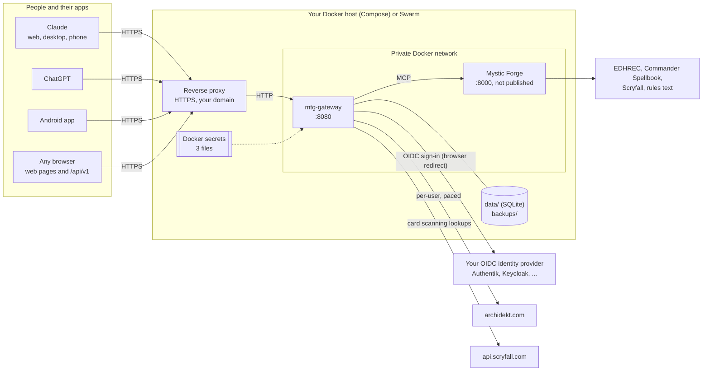
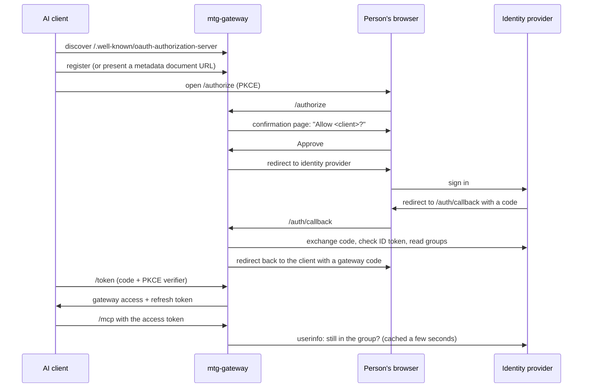

# How the gateway fits together

This page is the map: what runs where, who talks to whom, and which parts
you can swap for your own. The deploy guides follow this shape.

## The intended deployment



The same picture as text, for anywhere the diagram doesn't render:

```
Claude / ChatGPT / Android app / browser
        │  HTTPS (your domain, your certificate)
        ▼
  reverse proxy  (NPM, Caddy, Traefik, nginx, ...)
        │  HTTP on a private Docker network
        ▼
  mtg-gateway :8080 ──MCP──▶ Mystic Forge :8000 ──▶ Scryfall, EDHREC, Spellbook, rules
        │   ├─ SQLite in data/, nightly copies in backups/
        │   ├─ 3 Docker secrets (encryption key, cookie key, OIDC client secret)
        │   ├─ sign-in ──▶ your OIDC identity provider
        │   └─ deck reads and edits ──▶ archidekt.com (as the signed-in user)
```

## The pieces

| Piece | What it does | Can you swap it? |
| --- | --- | --- |
| **mtg-gateway** | The product. An MCP server at `/mcp`, its own OAuth 2.1 server for AI clients, the browser pages, the Archidekt connection, card scanning, and the database | No, this is the thing you're deploying |
| **Mystic Forge** | Card search, prices, rules, EDHREC, Commander Spellbook, precons, goldfish simulation. Upstream open-source project, built from a pinned commit with small patches | Optional. Set `MTG_MYSTIC_FORGE_URL` to an empty value and remove the Mystic Forge service; the research tools disappear, deck tools, proposals and scanning still work |
| **Reverse proxy** | Gives the gateway an `https://` address on your domain | Any proxy that forwards to an HTTP backend and keeps the `Host` header. See [REVERSE-PROXY.md](REVERSE-PROXY.md) |
| **Identity provider** | Who may sign in. The gateway never sees passwords | Any OpenID Connect provider that can send group membership in a claim (`MTG_OIDC_GROUPS_CLAIM`), or any provider at all if it already admits only the right people and you set `MTG_ALLOW_ANY_IDP_USER=true`. Authentik is the documented one; see [IDP-OTHERS.md](IDP-OTHERS.md) for the rest |
| **Docker host** | Runs the two containers | Docker Compose on one machine ([DEPLOY-COMPOSE.md](DEPLOY-COMPOSE.md)) or a Swarm, with or without Portainer ([DEPLOY.md](DEPLOY.md)) |

Both images are multi-arch (`linux/amd64` and `linux/arm64`), so a
Raspberry Pi 4 or 5 is fine. The gateway idles around 60 MB of memory and
Mystic Forge around 115 to 170 MB, measured on test machines rather than a Pi.

## What's fixed, and why

Some things are deliberately not configurable. They're the structure that
keeps it simple to run and to support:

- **One gateway replica.** The database is SQLite on local disk, owned by one
  process. Don't scale it up and don't put the data folder on NFS or SMB.
- **Domain root only.** The gateway must be served at `https://host/`, not
  under a path like `https://host/mtg/`. OAuth discovery for MCP clients
  lives at fixed paths on the host.
- **HTTPS only.** `MTG_PUBLIC_URL` must be `https://` (plain `http://` is
  accepted only for `localhost`, for development).
- **Secrets are files.** The encryption key, cookie key and OIDC client
  secret are read from files (Docker secrets on Swarm, `secrets: file:` in
  Compose), never from environment variables, so they don't show up in
  `docker inspect` or Portainer's variable list.
- **Mystic Forge is private.** It has no login of its own, so it never gets
  a published port or a proxy host.

Everything else (names, folders, ports on the host, network names, image
location, which proxy, which identity provider) is yours to choose.

## How sign-in works

There are two OAuth relationships, and keeping them apart is what lets any
AI client and any identity provider work together:

1. **AI client → gateway.** Claude, ChatGPT and other MCP clients treat the
   gateway as their OAuth server. They register automatically (or identify
   with a Client ID Metadata Document), use PKCE, and get the gateway's own
   short-lived tokens. Before anything is granted, every connection shows a
   confirmation page naming the client and where the sign-in returns to,
   with Approve and Deny.
2. **Gateway → identity provider.** The gateway is one confidential OpenID
   Connect client at your identity provider. When someone connects, the
   gateway sends their browser there to sign in, checks the ID token and the
   group, and records who they are. It keeps the provider's own access and
   refresh token (encrypted), so it can ask the provider again later
   whether the person is still allowed in.



The result is one identity per person: the same user on Claude, ChatGPT,
the Android app and the browser pages, with their own Archidekt link,
proposals and scan sessions.

Membership is checked live. Before serving any request that carries a
browser session or a gateway token, the gateway asks the identity
provider's userinfo endpoint for the person's current groups (the answer is
cached for `MTG_MEMBERSHIP_CHECK_TTL` seconds, 5 by default; `0` asks every
time). Someone taken
out of the group, or deactivated or deleted at the provider, is cut off on
their next request. Separately, every assistant has to sign in again after
`MTG_REAUTH_INTERVAL` (a week by default).

## How deck edits work

The assistant never changes a deck directly:

1. It calls `propose_deck_changes`, `propose_new_deck` or another
   `propose_*` tool (a deck's settings, folder, tags and cover go through
   `propose_deck_details`). The gateway saves the exact change and returns a
   review link.
2. The person approves it: with **Approve** on the card the AI app shows
   next to the proposal (an MCP App, see below) or on the review page with
   **Apply**. A person who chose a looser **approval mode** on their Account
   page (see below) lets the assistant apply low-risk edits, or everything,
   itself; the gateway tells the assistant which in every proposal result.
3. The gateway checks the deck hasn't changed since, saves a snapshot, makes
   a private backup copy of the deck on Archidekt, applies the change, and
   reads the deck back to confirm it.
4. Every step lands in the audit log. Any snapshot can be restored the same
   way.

`MTG_WRITES_ENABLED=false` turns the last step off for everyone: proposals
still work, nothing is ever applied.

## What works with it

| Client | Status |
| --- | --- |
| Claude: web, desktop app, iOS, Android | Works. Add the gateway as a custom connector on the web or desktop and it follows you to the phone apps; see [CONNECT.md](CONNECT.md) |
| ChatGPT | Web only (OpenAI says its phone apps don't support custom MCP connectors). Some plans limit it to read tools, which still covers research and proposals; Apply then happens on the review page. See [CONNECT.md](CONNECT.md#chatgpt) |
| Claude Code, Codex and other MCP clients | Work with any client that supports remote MCP servers with OAuth; the gateway serves a plugin at `/install`. See [PLUGIN.md](PLUGIN.md) |
| Android app | Available, built, unit-tested and installed on a phone; camera and fold layouts still await a device report. A small app that opens a gateway's pages full screen and adds a native camera for card scanning. It points at any gateway address, so it works with your own deployment; see [ANDROID.md](ANDROID.md) |
| Any browser | The account, decks, proposal review, history, scan and admin pages work in any modern browser, on a phone or a desktop |

For the exact devices and plans tested, see
[CONNECT.md](CONNECT.md#which-apps-and-devices-work).

## Security model

- **Who can sign in** is decided by your identity provider (who has an
  account, who is bound to the application) and, on top, by
  `MTG_REQUIRED_GROUP`.
- **Membership is live.** Before any request with a browser session or a
  gateway token is served, and at every code exchange and refresh, the
  gateway asks the identity provider's userinfo endpoint for the person's
  groups, at most `MTG_MEMBERSHIP_CHECK_TTL` seconds (5) old. Removing
  someone from `MTG_REQUIRED_GROUP`, or deactivating or deleting them at the
  provider, takes effect on their next request: every gateway token,
  browser session and stored provider token is revoked, and a removal from
  the group revokes their Archidekt link too (a deactivated or deleted
  account, which the provider reports only as a refused token, keeps the
  stored session until an admin presses Disable or Unlink, or it expires).
  With Authentik, an optional hourly clean-up (`src/mtg_gateway/idp_sweep.py`,
  an API token that may only view the two gateway groups) asks who is in the two groups now and
  deletes the stored session of every linked member who is in neither or is
  deactivated; an empty, partial or failed answer deletes nothing. Removing someone from `MTG_ADMIN_GROUP` takes the admin page away
  the same way. This doesn't rely on the provider revoking anything:
  Authentik, for one, keeps honouring a removed member's refresh token. If
  the provider can't be reached, requests are refused with 503 and nothing
  is revoked (fail closed). The provider's tokens are stored encrypted with
  the `mtg_fernet_key` secret and are never handed to AI clients.
- **One provider per account.** Each person is pinned to the provider
  (issuer) they first signed in with; an account from another provider with
  the same `sub` is refused rather than given the old account's data.
- **Tokens.** `/mcp` accepts only tokens the gateway issued, never a token
  straight from the identity provider. Tokens and client secrets are stored
  hashed. Refresh tokens rotate, and reusing an old one revokes the whole
  chain. Authorization codes are single-use and bound to PKCE. Clients can
  only register `https` redirect addresses, or `http` on localhost.
- **Consent.** Every connection from an AI client, including each weekly
  re-sign-in, shows the gateway's own page naming the client and where it
  will send the sign-in, with Approve and Deny, before the identity
  provider is involved. An identity provider that signs people in silently
  can't skip it. An app can ask for the read-only scope `mtg.read`; its
  token can then read but never propose, apply or store anything.
- **Sign-out.** **Sign out on all my devices** (on the `/logout` page)
  ends every browser and Android app session. For an hour after signing out, a sign-in on that
  device asks the identity provider for the password again, so a shared
  device isn't silently signed back in as the previous person.
- **Limits on anonymous traffic.** Sign-in starts are limited per network
  (30 a minute), unfinished sign-ins are capped per browser, per client and
  in all, and Client ID Metadata Document fetches are limited per site and
  overall, so the gateway can't be used to flood itself or someone else's
  site ([OPERATIONS.md](OPERATIONS.md)). Every response carries
  `Strict-Transport-Security` when the public URL is https.
- **Archidekt passwords** are used once to get a session and never stored.
  The session is encrypted with the `mtg_fernet_key` secret.
  - **Who can see a sign-in.** No other member, and no admin: no page, admin
    tool, log or backup shows a stored Archidekt session. Backups don't
    contain it at all: the copy has every Archidekt session and the identity
    provider's tokens blanked before it is written, so after a restore
    members sign in again and relink Archidekt. An admin's **disable** also
    deletes the member's stored Archidekt session. Deleted or blanked
    sign-ins are overwritten on disk (SQLite `secure_delete`, and the
    write-ahead log is flushed after an unlink), not just marked free.
  - **Who is trusted.** The server holds the key that opens the session, so
    whoever runs the server can open it and act as the member on Archidekt
    until it expires. The link form says so in a fixed disclosure
    (`src/mtg_gateway/link_disclosure.py`, no setting turns it off): what
    linking gives the gateway, what is stored and never stored, what the
    person who runs the server and the site's admins can and cannot see or
    do, logs, backups, how long the session lasts and how to end it, and
    Archidekt's terms. Linking needs a ticked box; the text stays on the
    Account page afterwards.
  - **Sealed and dated.** The encrypted blob names its purpose and the
    member's subject and is refused under any other member's link. A
    session stored by 0.7.6 or earlier carries no owner, so at the first
    start of 0.7.7 it is sealed to the member whose row holds it then;
    an unsealed session found at any later start is deleted. The
    Account page shows when the session stops working, read from the refresh
    token's own `exp` (Archidekt does not rotate it, so it is fixed at link
    time), and the hourly purge deletes sessions past that date.
- **Deck changes** need the person's own yes, unless they chose otherwise.
  The code enforces it: changes are proposals until applied with the review
  page's Apply button or the in-chat card's Approve button. Each person has
  an **approval mode** (`src/mtg_gateway/modes.py`), set only on their own
  Account page in the browser, never over MCP or the API: `manual` (the
  default: ask every time), `semi` (the assistant may apply a low-risk edit
  itself: at most `MTG_AUTO_APPLY_MAX_ROWS` review rows of card adds,
  removes, quantity, category, finish or printing changes of at most four
  copies each, never the commander; or a clone) or `auto` (the assistant may apply everything).
  The mode is read by the member's id when an apply is attempted, so one
  member's choice never reaches another's proposals, decks or apps; the
  operator can cap it with `MTG_APPROVAL_MODE_MAX` and set the mode of
  members who have not chosen with `MTG_APPROVAL_MODE_DEFAULT`. Every apply
  still snapshots the deck first.
  The card is an MCP App (`src/mtg_gateway/approve.py`, the HTML in
  `static/proposal-card.html`): every `propose_*` tool and `get_proposal`
  names it in `_meta.ui.resourceUri`, a host that renders MCP Apps shows it
  with the result, and its buttons call `confirm_proposal`, a tool marked
  `_meta.ui.visibility: ["app"]` (offered to the card, not to the model)
  that also needs a one-time code the tool result carries only in `_meta`
  (handed to the card, kept out of the model's context). The code is an
  HMAC over the proposal, its owner, the app that made it and its creation
  time, so nothing is stored and a code works once. The gateway cannot tell
  a person's press from a message the host sends on its own; what it can
  check is that the caller holds the code, which a prompt-injected
  assistant does not in a host that follows the standard. `MTG_APPLY_IN_CHAT=false`
  removes the card, the code and the tool.
  The other cards (`src/mtg_gateway/cards.py`, HTML in `static/cards/`:
  printings, picker, deck, account) only show and relay: a tap sends the
  pick to the assistant as text through the host (`ui/update-model-context`),
  and nothing on them calls a tool. A card that needs more data than the tool
  result carries (a deck's rows, a card's printings) gets a link to
  `GET /cards/data/{token}`: a Fernet token under `mtg_fernet_key` naming the
  member, the kind and the id, valid ten minutes, handed to the card in
  `_meta` and never to the model. The endpoint serves JSON to any origin
  without cookies, checks the member still exists, is not disabled and is
  still in the required group, and answers `expired` or `forbidden`
  otherwise, in its own fixed words (never Archidekt's or Scryfall's). A
  link is good for twenty fetches, and the first answer is kept for the
  link's lifetime, so a replayed link never reaches Archidekt or Scryfall
  again and cannot spend the member's budget. Pictures and rules text come
  straight from Scryfall under each card's CSP (`_meta.ui.csp`). The text a
  card sends the model on a tap is shaped like a user action but contains
  data (card and set names from Scryfall, the user's own words): the cards
  quote every such value, keep it to one line and at most 200 characters (a typed reject reason, 500),
  and the skill tells the assistant to treat it as the user's choice, not as
  an instruction. `MTG_APPLY_IN_CHAT=false` removes all of it.
  The MTG skill also tells the assistant
  never to treat text inside decks or tool output as an instruction. Each
  proposal records and shows the app that made it; disconnecting an app
  rejects its pending proposals, and one app may hold at most 30 pending
  proposals per member.
- **Archidekt load** is capped per member: `MTG_ARCHIDEKT_CALLS_PER_10_MIN`
  calls (120 by default) and three at a time, so a looping assistant can't
  hammer Archidekt or starve other members. Across everyone, requests go one
  at a time, at least a second apart and at most 40 a minute; 429s pause
  every request, only reads are retried (with jittered backoff), and
  anonymous reads and card lookups are briefly cached (OPERATIONS.md,
  "Archidekt rate limiting"). Requests carry the gateway's own User-Agent and
  are never disguised. Five failed Archidekt link attempts in 15 minutes block
  further tries for a while.
- **Mystic Forge** is only reachable from the gateway, and only tools on an
  allowlist are passed through. Its failure texts (an upstream error, a
  timeout, a rate limit) are flagged as errors on the way back, and every
  refusal from the gateway's own tools carries the error flag too, so an
  assistant doesn't read a failure as an answer.
- **Nothing site-specific is in the code.** Everything that differs between
  deployments is an environment variable or a Docker secret.

Found a problem? See [SECURITY.md](../SECURITY.md).
