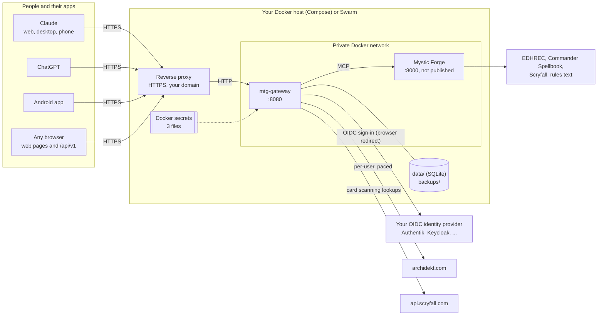
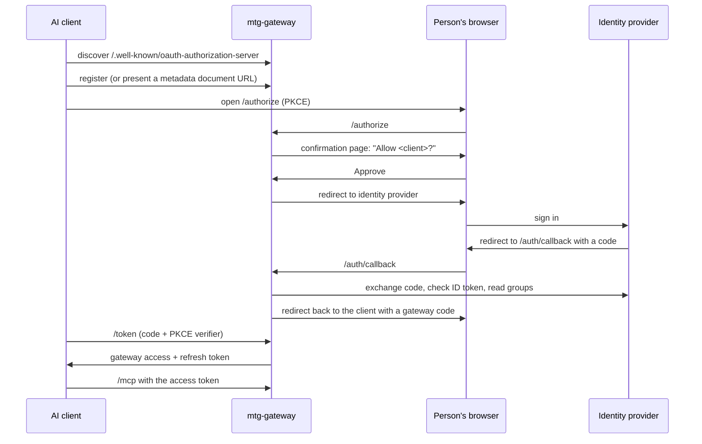

# How the gateway fits together

This page is the map: what runs where, who talks to whom, and which parts
you can swap for your own. The deploy guides follow this shape.

## The intended deployment



The same picture as text, for anywhere the diagram doesn't render:

```
Claude / ChatGPT / Android app / browser
        │  HTTPS (your domain, your certificate)
        ▼
  reverse proxy  (NPM, Caddy, Traefik, nginx, ...)
        │  HTTP on a private Docker network
        ▼
  mtg-gateway :8080 ──MCP──▶ Mystic Forge :8000 ──▶ Scryfall, EDHREC, Spellbook, rules
        │   ├─ SQLite in data/, nightly copies in backups/
        │   ├─ 3 Docker secrets (encryption key, cookie key, OIDC client secret)
        │   ├─ sign-in ──▶ your OIDC identity provider
        │   └─ deck reads and edits ──▶ archidekt.com (as the signed-in user)
```

## The pieces

| Piece | What it does | Can you swap it? |
| --- | --- | --- |
| **mtg-gateway** | The product. An MCP server at `/mcp`, its own OAuth 2.1 server for AI clients, the browser pages, the Archidekt connection, card scanning, and the database | No, this is the thing you're deploying |
| **Mystic Forge** | Card search, prices, rules, EDHREC, Commander Spellbook, precons, goldfish simulation. Upstream open-source project, built from a pinned commit with small patches | Optional. Set `MTG_MYSTIC_FORGE_URL` to an empty value and remove the Mystic Forge service; the research tools disappear, deck tools, proposals and scanning still work |
| **Reverse proxy** | Gives the gateway an `https://` address on your domain | Any proxy that forwards to an HTTP backend and keeps the `Host` header. See [REVERSE-PROXY.md](REVERSE-PROXY.md) |
| **Identity provider** | Who may sign in. The gateway never sees passwords | Any OpenID Connect provider that can send group membership in a claim (`MTG_OIDC_GROUPS_CLAIM`), or any provider at all if it already admits only the right people and you set `MTG_ALLOW_ANY_IDP_USER=true`. Authentik is the documented one; see [IDP-OTHERS.md](IDP-OTHERS.md) for the rest |
| **Docker host** | Runs the two containers | Docker Compose on one machine ([DEPLOY-COMPOSE.md](DEPLOY-COMPOSE.md)) or a Swarm, with or without Portainer ([DEPLOY.md](DEPLOY.md)) |

Both images are multi-arch (`linux/amd64` and `linux/arm64`), so a
Raspberry Pi 4 or 5 is fine. The gateway idles around 60 MB of memory and
Mystic Forge around 115 to 170 MB, measured on test machines rather than a Pi.

## What's fixed, and why

Some things are deliberately not configurable. They're the structure that
keeps it simple to run and to support:

- **One gateway replica.** The database is SQLite on local disk, owned by one
  process. Don't scale it up and don't put the data folder on NFS or SMB.
- **Domain root only.** The gateway must be served at `https://host/`, not
  under a path like `https://host/mtg/`. OAuth discovery for MCP clients
  lives at fixed paths on the host.
- **HTTPS only.** `MTG_PUBLIC_URL` must be `https://` (plain `http://` is
  accepted only for `localhost`, for development).
- **Secrets are files.** The encryption key, cookie key and OIDC client
  secret are read from files (Docker secrets on Swarm, `secrets: file:` in
  Compose), never from environment variables, so they don't show up in
  `docker inspect` or Portainer's variable list.
- **Mystic Forge is private.** It has no login of its own, so it never gets
  a published port or a proxy host.

Everything else (names, folders, ports on the host, network names, image
location, which proxy, which identity provider) is yours to choose.

## How sign-in works

There are two OAuth relationships, and keeping them apart is what lets any
AI client and any identity provider work together:

1. **AI client → gateway.** Claude, ChatGPT and other MCP clients treat the
   gateway as their OAuth server. They register automatically (or identify
   with a Client ID Metadata Document), use PKCE, and get the gateway's own
   short-lived tokens. Before anything is granted, every connection shows a
   confirmation page naming the client and where the sign-in returns to,
   with Approve and Deny.
2. **Gateway → identity provider.** The gateway is one confidential OpenID
   Connect client at your identity provider. When someone connects, the
   gateway sends their browser there to sign in, checks the ID token and the
   group, and records who they are.



The result is one identity per person: the same user on Claude, ChatGPT,
the Android app and the browser pages, with their own Archidekt link,
proposals and scan sessions.

Every assistant has to sign in again after `MTG_REAUTH_INTERVAL` (a week by
default), which re-checks group membership at the identity provider.

## How deck edits work

The assistant never changes a deck directly:

1. It calls `propose_deck_changes` or `propose_new_deck`. The gateway saves
   the exact change and returns a review link.
2. The person approves it: on the review page with **Apply**, or in chat if
   the operator turned on `MTG_APPLY_VIA_MCP` (and only after a short
   minimum age, so a proposal can't be made and applied in one breath).
3. The gateway checks the deck hasn't changed since, saves a snapshot, makes
   a private backup copy of the deck on Archidekt, applies the change, and
   reads the deck back to confirm it.
4. Every step lands in the audit log. Any snapshot can be restored the same
   way.

`MTG_WRITES_ENABLED=false` turns the last step off for everyone: proposals
still work, nothing is ever applied.

## What works with it

| Client | Status |
| --- | --- |
| Claude: web, desktop app, iOS, Android | Works. Add the gateway as a custom connector on the web or desktop and it follows you to the phone apps; see [CONNECT.md](CONNECT.md) |
| ChatGPT | Web only (OpenAI says its phone apps don't support custom MCP connectors). Some plans limit it to read tools, which still covers research and proposals; Apply then happens on the review page. See [CONNECT.md](CONNECT.md#chatgpt) |
| Claude Code, Codex and other MCP clients | Work with any client that supports remote MCP servers with OAuth; the gateway serves a plugin at `/install`. See [PLUGIN.md](PLUGIN.md) |
| Android app | Available, built and unit-tested; not yet tested on a device. A small app that opens a gateway's pages full screen and adds a native camera for card scanning. It points at any gateway address, so it works with your own deployment; see [ANDROID.md](ANDROID.md) |
| Any browser | The account, decks, proposal review, history, scan and admin pages work in any modern browser, on a phone or a desktop |

For the exact devices and plans tested, see
[CONNECT.md](CONNECT.md#which-apps-and-devices-work).

## Security model

- **Who can sign in** is decided by your identity provider (who has an
  account, who is bound to the application) and, on top, by
  `MTG_REQUIRED_GROUP`. The group is read from the identity provider at each
  sign-in, and the groups recorded then are checked again on every token
  refresh and every browser page. Removing someone from the group therefore
  takes effect at their next sign-in (within `MTG_REAUTH_INTERVAL` for
  assistants); to cut someone off at once, see
  [OPERATIONS.md](OPERATIONS.md#revoking-access).
- **Tokens.** `/mcp` accepts only tokens the gateway issued, never a token
  straight from the identity provider. Tokens and client secrets are stored
  hashed. Refresh tokens rotate, and reusing an old one revokes the whole
  chain. Authorization codes are single-use and bound to PKCE. Clients can
  only register `https` redirect addresses, or `http` on localhost.
- **Consent.** Every connection from an AI client, including each weekly
  re-sign-in, shows the gateway's own page naming the client and where it
  will send the sign-in, with Approve and Deny, before the identity
  provider is involved. An identity provider that signs people in silently
  can't skip it.
- **Archidekt passwords** are used once to get a session and never stored.
  The session is encrypted with the `mtg_fernet_key` secret, which protects
  the database and its backups. It doesn't protect against whoever runs the
  server, and users are told that.
- **Deck changes** need the person's own yes. The code enforces it: changes
  are proposals until applied with the review page's Apply button, or in
  chat only when `MTG_APPLY_VIA_MCP` allows it and the proposal is older
  than `MTG_APPLY_MIN_AGE_SECONDS`. The MTG skill also tells the assistant
  never to treat text inside decks or tool output as an instruction.
- **Mystic Forge** is only reachable from the gateway, and only tools on an
  allowlist are passed through.
- **Nothing site-specific is in the code.** Everything that differs between
  deployments is an environment variable or a Docker secret.

Found a problem? See [SECURITY.md](../SECURITY.md).
